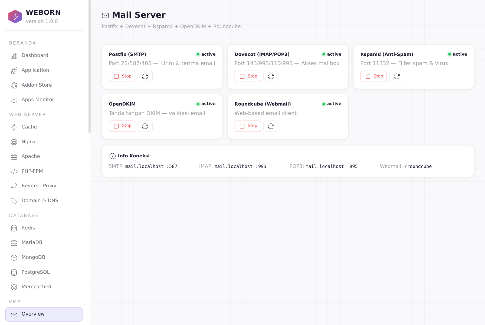
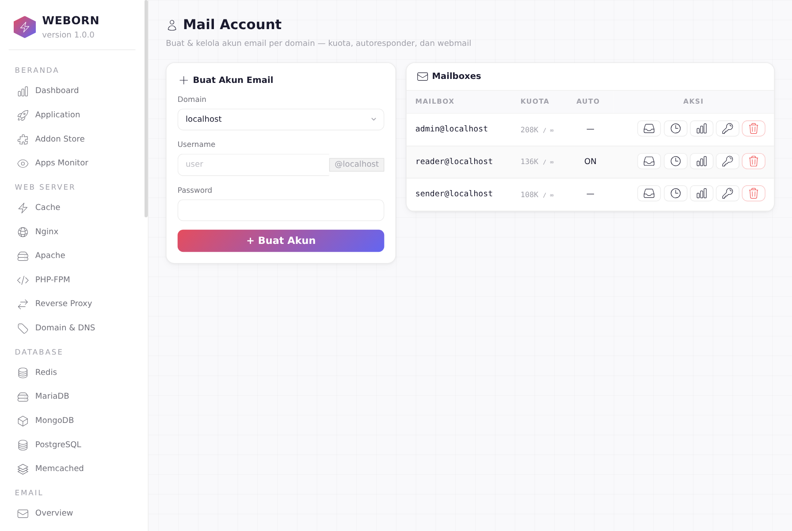
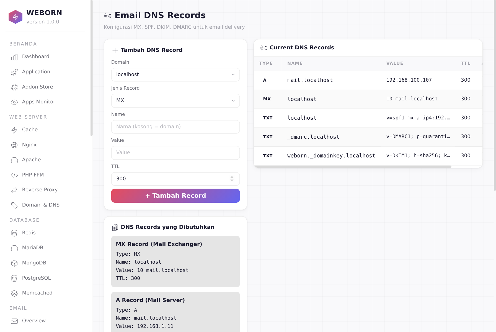
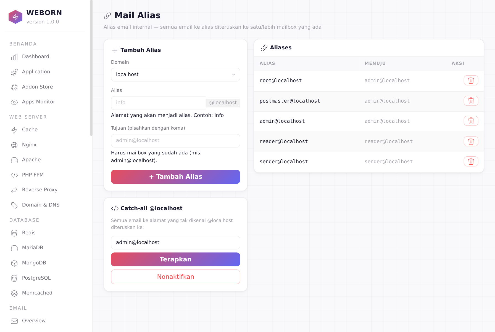

# Weborn

<p align="center">
  
</p>

<p align="center">
  
  
  
  
  
</p>

Weborn is a self-hosted control panel for running, securing, and managing server-side services from one clean dashboard. It provides a unified interface for application deployment, domain management, database administration, monitoring, security hardening, and system operations.

## Screenshots

<p align="center">
  
  
  <br/>
  
  
</p>

## Architecture

```
Client (Browser)
  │
  ├─ Nginx (Port 80/443) — Reverse Proxy + Static File Server
  │   ├─ Static files → direct serve
  │   ├─ PHP/Laravel → PHP-FPM (unix socket)
  │   ├─ Python WSGI → Gunicorn (sync workers) → Django/Flask
  │   ├─ Python ASGI → Gunicorn + UvicornWorker → FastAPI
  │   └─ Node.js → reverse proxy port
  │
  ├─ Gunicorn / Uvicorn — Process Manager
  │   ├─ WSGI:  gunicorn -w N main:app --bind unix:/run/gunicorn/{name}.sock
  │   ├─ ASGI:  gunicorn -w N -k uvicorn.workers.UvicornWorker --bind unix:/run/gunicorn/{name}.sock
  │   └─ ASGI:  uvicorn main:app --host 0.0.0.0 --port {port} --workers N
  │
  └─ Weborn Panel (Port 2025) — Control Panel UI
      ├─ Session auth (SQLite) + PAM fallback (Linux users)
      ├─ CSRF protection + rate limiting
      └─ Real-time monitoring via WebSocket (xterm.js)
```

## Documentation

Full documentation is available at **[https://adyoi.github.io/Weborn](https://adyoi.github.io/Weborn)** — Getting Started, Features, Architecture, and Changelog.

## What's New (v1.0.1)

- **GitHub Pages Documentation** — Full docs site: Getting Started, Features, Architecture, Changelog
- **Unit Test Suite** — 52 tests: CSRF, JWT, rate limiter, executors, path traversal, worker injection
- **`update.sh`** — One-command sync script for server deployment (tar + pip + restart)
- **Password Policy** — Min 8 chars with uppercase, lowercase, digit, and symbol enforcement
- **Path Traversal Fix** — PHP regex validation + `..` rejection in config editor
- **Worker Class Injection** — Whitelist blocks shell injection via `worker_class` parameter
- **Template XSS Fix** — No `tojson` in attributes (breaks `onclick`/`data-*`); dynamic JS values move through `data-*` + `addEventListener`
- **Template URL Fix** — Space-in-url bugs fixed across all 19 HTML templates
- **CSRF Token Fix** — Trailing space that broke HMAC validation removed
- **Apache Auto-Install** — Auto-installs if missing when starting Apache manager
- **Apache Port Auto-Increment** — Finds free ports when 80/443 are taken
- **Addon Uninstall** — Trailing space URLs fixed + `apt-get autoremove` after removal

See [CHANGELOG.md](CHANGELOG.md) for full version history.

## Key Features

### 🏠 Dashboard & System
- Real-time system monitoring (CPU, RAM, Disk)
- Application stats (total, running, stopped)
- Panel user count
- Installed services with start/stop/restart table

### 📦 Application Management (Weborn Core)
- Create isolated apps with dedicated user, directory, and socket
- **WSGI** — Django, Flask, Pyramid, Bottle, Tornado (Gunicorn sync workers)
- **ASGI** — FastAPI, Litestar, Sanic (Gunicorn + UvicornWorker or standalone Uvicorn)
- **PHP** — Laravel, WordPress, Symfony, CodeIgniter, Slim (PHP-FPM)
- **Node.js** — Express, Next.js, Fastify, NestJS, Hono, SvelteKit, Astro (direct process)
- **Static** — HTML/CSS/JS sites (Nginx direct)
- Native app support: custom command + directory + module:app validation
- Framework presets with auto-scaffold

### 🧠 Process Monitor
- Real-time Gunicorn/Uvicorn worker status (PID, CPU%, MEM%, uptime)
- Start / Stop / Restart / Reload controls per app
- **Process Manager Config** — Edit workers, timeout, worker class, max requests, graceful timeout, keep alive, access log
- **Resource Limits** — MemoryMax, CPUQuota, Nice, OOMScoreAdjust (systemd integration)
- **Trace Log** — Live xterm.js log streaming via WebSocket (`journalctl -u`)
- **Weborn Panel** — Self-monitoring with worker table, resource usage, Trace Log
- **Orphan Detection** — Finds rogue gunicorn/uvicorn processes with kill APIs
- Auto-refresh mode (5s interval)
- Master PID detection with single-level process traversal (bash → process → workers)

### 🌐 Web Server
- **Nginx** — Reverse proxy, static files, site config management
- **PHP-FPM** — FastCGI Process Manager for PHP apps
- **Cache** — Redis (object cache + sessions) and Memcached
- SSL/TLS via Let's Encrypt (Certbot) or self-signed (`--ssl-cert` / `--ssl-key`)
- Reverse proxy support

### 🗄️ Database Management
- **MariaDB/MySQL** — User management, database CRUD
- **PostgreSQL** — Full management
- **MongoDB** — NoSQL management
- **Redis** — Cache & session store
- **Memcached** — Lightweight cache

### 📧 Mail Server
- **Postfix** (SMTP) — Port 25/587/465 + submission `STARTTLS`/`TLS wrap`
- **Dovecot** (IMAP/POP3) — Port 143/993/110/995 (Sieve + kuota per mailbox)
- **Rspamd** — Anti-spam tunggal dengan ML scoring (via milter)
- **OpenDKIM** — DKIM signing + verifikasi untuk email authentication
- **SPF/DMARC** — DNS-based email authentication (auto-generate record)
- **Mail Account** — mailbox CRUD, ubah password, kuota, autoresponder vacation (Sieve)
- **Mail Alias / Forwarder / Mailing List / Catch-all** — manajemen relasi virtual Postfix
- **Mail DNS** — kelola record MX/SPF/DKIM/DMARC untuk tiap mail domain
- **Multi-domain** — dukungan beberapa mail domain (localhost primary, TLS otomatis)
- **Roundcube** — Web-based email client (instal via panel)
- Automated setup wizard dengan DNS record generation

### 🔒 Security
- **CSRF Protection** — Token-based validation on all POST form submissions
- **WebSocket Auth** — Session validation on all WebSocket endpoints (terminal, logs)
- **Rate Limiting** — Login rate limit (5 attempts per 5 minutes per IP)
- **Session Hardening** — `httponly`, `max_age=24h`, `secure` flag when SSL
- **Session Idle Lock** — Configurable per-user timeout, auto-locks inactive sessions
- **Shell Injection Prevention** — `shlex.quote()` on all user input in bash commands
- **UFW** — Firewall rule management (Allow/Block ports)
- **Fail2Ban** — Intrusion prevention (Ban/Unban IPs)
- **ClamAV** — Antivirus scanning (system + mail)
- **Certbot** — Let's Encrypt SSL certificates
- **Backup** — System backup and restore

### 📊 Monitoring
- Centralized log viewer (system, auth, nginx, mysql, panel)
- Process viewer (psutil)
- Cron job scheduling
- Network monitoring

### 💻 Remote Access
- WebSocket terminal (PTY-based)
- File explorer with edit/chown/chmod
- SSH / SFTP / RDP / VNC / NFS user management
- OS user management with lock/unlock

### 🔐 Authentication
- **JWT (HS256)** — Stateless tokens in HTTP-only cookies, 24h expiry
- **Panel users** — SQLite-based with PBKDF2-SHA256 hashing
- **PAM fallback** — Linux users login with OS credentials (auto-creates shadow panel user)
- **Root login gate** — Root can login via PAM only after admin panel user exists
- Session management with 24-hour expiry + CSRF tokens
- Session idle lock with configurable per-user timeout
- Login rate limiting (5 attempts per 5 minutes per IP)
- Login audit trail (IP, timestamp, success/fail)

### 🧩 Addon Store (39 Addons)

| Category | Addons |
|----------|--------|
| **Web Server** | Nginx, Apache, Caddy, Lighttpd |
| **Database** | MySQL/MariaDB, PostgreSQL, Redis, MongoDB, Memcached |
| **Mail** | Dovecot, Postfix, Exim, SpamAssassin, Roundcube |
| **Remote Access** | OpenSSH, OpenVPN, FTP |
| **Security** | Fail2Ban, ClamAV, Certbot, AIDE, Lynis, UFW |
| **Runtime** | Python 3, PHP, Node.js, Golang, Ruby, Git, Docker, Supervisor |
| **Monitoring** | Cockpit, Glances, Grafana, Netdata, Prometheus, Htop, Logrotate |

Each addon supports: **Install → Config → Update → Start/Stop/Restart → Uninstall**

## Menu Structure

| Group | Items |
|-------|-------|
| **Beranda** | Dashboard, Addon Store |
| **Web Server** | Domain & DNS, Nginx, PHP-FPM, Cache, Reverse Proxy |
| **Database** | MariaDB, PostgreSQL, MongoDB, Redis, Memcached |
| **Mail Server** | Overview, Webmail, Mail List, Mail DNS, Mail Alias, Mail Security, Mail Account, Mail Forwarder |
| **Weborn** | WSGI Apps, ASGI Apps, Process Monitor |
| **Monitoring** | Logs, Proses, Network, Paket, Cron |
| **Access & Security** | Terminal, File Explorer, OS Users, Panel Users, Services, Firewall, Fail2Ban, ClamAV, Backup, Settings |

## Tech Stack

- **Backend:** Python 3.10+, FastAPI, SQLite, Jinja2, PyJWT
- **Frontend:** Tailwind CSS, xterm.js, WebSocket, marked.js (markdown)
- **Process Manager:** Gunicorn (WSGI) + Uvicorn (ASGI standalone)
- **Web Server:** Nginx (reverse proxy)
- **Mail:** Postfix + Dovecot + Rspamd + OpenDKIM + Roundcube
- **Auth:** JWT (HS256) + PAM (Linux Pluggable Authentication Modules) + CSRF tokens
- **Security:** shlex.quote(), rate limiting, session hardening
- **System:** systemd, psutil
- **Executor Modes:** Local (Linux), WSL, Dry-run (Windows dev)

## Requirements

- Python 3.10 or newer
- `pip`
- Linux or WSL recommended for full local execution
- Root access for privileged system tasks when using `--local`

## Quick Start

```bash
# 1 Clone the repository
git clone https://github.com/adyoi/Weborn.git
cd Weborn

# 2 Create and activate a virtual environment
python -m venv .venv
# Linux/macOS
source .venv/bin/activate
# Windows
.venv\Scripts\activate

# 3 Install dependencies
pip install -r requirements.txt

# 4 (Optional) Build Tailwind CSS assets
npm install
npm run css:build

# 5 Run the dashboard
# Development / dry-run (works on Windows)
python weborn.py --reload --host 127.0.0.1 --port 2025

# Full system execution on Linux/WSL (requires sudo)
sudo python weborn.py --local --host 0.0.0.0 --port 2025

# With SSL (self-signed or Let's Encrypt)
sudo python weborn.py --local --host 0.0.0.0 --port 2025 \
  --ssl-cert /path/to/cert.pem --ssl-key /path/to/key.pem
```

Open the dashboard in your browser:

```text
http://127.0.0.1:2025
# or with SSL:
https://127.0.0.1:2025
```

## First-Time Setup

1. Open the panel in your browser
2. You'll be redirected to `/setup` (first-time wizard)
3. Enter username and password (min 8 chars, requires uppercase + lowercase + digit + symbol)
4. Panel creates:
   - Panel admin account (SQLite)
   - Linux OS user with sudo/SSH access
5. Login with your new credentials
6. After setup, any Linux user can login with their OS password (PAM fallback)

## App Deployment Flow

When you create an app through the panel:

```
1. Panel creates OS user (weborn-{name})
2. Panel creates directory (/var/www/{name})
3. Panel writes starter file (main.py, server.js, etc.)
4. Panel installs dependencies (pip install, npm install)
5. Panel writes .env config
6. Panel writes systemd unit (weborn-{name}.service)
7. Panel generates Nginx site config
8. Panel enables & starts the service
```

For Python apps, Gunicorn or Uvicorn is the process manager:

```bash
# WSGI (Django/Flask) — Gunicorn
gunicorn main:app -w 4 --bind unix:/run/gunicorn/{name}.sock

# ASGI (FastAPI) — Gunicorn + UvicornWorker
gunicorn main:app -w 4 -k uvicorn.workers.UvicornWorker --bind unix:/run/gunicorn/{name}.sock

# ASGI (FastAPI) — Uvicorn standalone
uvicorn main:app --host 0.0.0.0 --port {port} --workers 4
```

## Executor Modes

| Mode | Description |
|------|-------------|
| `local` | Direct execution on Linux (requires root) |
| `wsl` | Execute via WSL distro (Debian default) |
| `dry-run` | Simulate commands without execution (Windows dev) |

Auto-detection: Linux → `local`, Windows → `dry-run`

Set via environment variable:
```bash
export WEBORN_EXECUTOR_MODE=local
# or
export WEBORN_EXECUTOR_MODE=wsl
export WEBORN_WSL_DISTRO=Debian
```

## SSL Support

```bash
# Self-signed (for development/testing)
python weborn.py --local --ssl-cert /path/to/cert.pem --ssl-key /path/to/key.pem

# Let's Encrypt (production)
certbot certonly --standalone -d yourdomain.com
# Then point to the generated files
python weborn.py --local --ssl-cert /etc/letsencrypt/live/yourdomain.com/fullchain.pem --ssl-key /etc/letsencrypt/live/yourdomain.com/privkey.pem
```

When SSL is active, session cookies automatically get the `secure` flag.

## Security Features

| Feature | Description |
|---------|-------------|
| **CSRF** | HMAC-based tokens on all POST forms + AJAX headers |
| **WebSocket Auth** | Session cookie validation before accepting connections |
| **Rate Limiting** | Token bucket per key (login: 5/5min, API endpoints vary) |
| **Session Hardening** | `httponly`, `max_age=24h`, `secure` when SSL |
| **Session Idle Lock** | Per-user timeout, auto-locks inactive sessions |
| **Shell Injection** | `shlex.quote()` on all user input in bash commands |
| **Path Traversal** | PHP regex validation + `..` rejection in config editor |
| **Worker Injection** | Whitelist for worker_class parameter |
| **Password Policy** | Min 8 chars, uppercase + lowercase + digit + symbol |
| **Password Hashing** | PBKDF2-SHA256 (SQLite) + PAM shadow users |
| **Audit Trail** | Login logs with IP, timestamp, success/fail |

## PAM Authentication

Weborn supports PAM (Pluggable Authentication Modules) for Linux user login:

- **How it works:** When a user tries to login, the panel first checks the SQLite panel database. If the user is not found or the password doesn't match, it falls back to Linux PAM authentication via `su`.
- **Shadow users:** If PAM authentication succeeds and the user doesn't exist in the panel DB, a shadow user is auto-created (with a random password hash — login only via PAM).
- **Root login:** Root can login via PAM only after an admin panel user already exists (security gate).
- **Config:** Set `USE_PAM = True` in `weborn/config.py` to enable/disable.

## Frontend Build

```bash
npm install
npm run css:build     # Build CSS
npm run css:watch     # Watch for changes
```

## Installer

On Debian/Ubuntu, install Weborn with:

```bash
sudo bash install.sh
```

- Installs the service under `/opt/weborn`
- Creates the required `data/backups` directory
- Adds a systemd unit (`weborn.service`) and reloads the daemon

To update an existing installation:

```bash
sudo bash update.sh
# or without restarting:
sudo bash update.sh --no-restart
```

To remove:

```bash
sudo bash uninstall.sh
```

## Testing

Weborn includes a test suite covering CSRF, JWT auth, rate limiting, executor modes, and security hardening.

```bash
# Run all unit tests (no pytest required, stdlib only)
.venv/bin/python test/run_tests.py

# Integration test (requires running panel)
WEBORN_PASS=yourpassword sudo -E .venv/bin/python test/test_apps_integration.py
```

| Test File | Coverage |
|-----------|----------|
| `test_csrf.py` | Token generation, validation, session binding, determinism |
| `test_auth.py` | JWT encode/decode, tampered tokens, idle lock |
| `test_executors.py` | DryRunExecutor mode, run, write/read file |
| `test_apps_security.py` | Path traversal, PHP regex, config whitelist, worker class injection |
| `test_ratelimit.py` | Token bucket, limit exceeded, independent keys |
| `test_apps_integration.py` | Login, CSRF, app CRUD via HTTP (requires panel) |

## Security Note

Weborn creates Linux users with sudo privileges during setup. In production:
- Use strong passwords
- Configure SSH key authentication
- Enable firewall (UFW)
- Run behind a reverse proxy with HTTPS
- Regularly update packages
- Consider disabling PAM fallback if not needed (`USE_PAM = False`)

## Contributing

1. Fork the repository
2. Create a feature branch (`git checkout -b my-feature`)
3. Make your changes and ensure the code follows existing style (PEP 8)
4. Commit with a clear message
5. Open a Pull Request against the `main` branch

## Contributors

- **adyoi** — Creator & Lead Developer
- **OpenCode** — AI-powered development assistant

## License

This project is licensed under the MIT License. See the `LICENSE` file for details.
