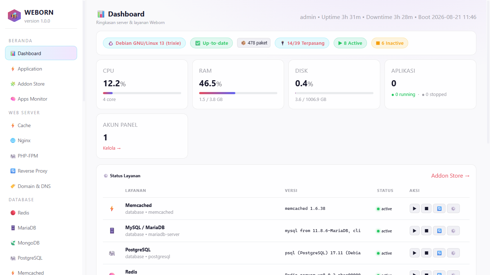

# Weborn

<p align="center">
  
</p>

<p align="center">
  
  
  
  
</p>

Weborn is a self-hosted control panel for running, securing, and managing server-side services from one clean dashboard. It gives you a single place to manage applications, runtime environments, domains, databases, cron jobs, backups, and system-level operations without juggling multiple tools.

## Why Weborn?

Weborn is built for people who want a simpler way to manage common server tasks without exposing themselves to a fragmented stack of separate tools. It brings deployment, monitoring, maintenance, and administration together in one interface.

## Key features

- Dashboard with system health and service status overview
- User authentication and account management
- Web app and runtime management
- Support for Node.js, Python, PHP, Django, FastAPI, Laravel, and similar stacks
- Domain, proxy, database, cron, backup, and system configuration tools
- Addon-based extensibility for custom modules
- Local executor mode for privileged operations on Linux and WSL

## Tech stack

- Python 3.10+
- FastAPI
- Jinja2 templates
- SQLite
- Tailwind CSS
- Debian/Ubuntu installer scripts

## Repository structure

```text
.
├── run.py                # app entry point
├── requirements.txt      # Python dependencies
├── install.sh            # Debian/Ubuntu installer
├── uninstall.sh          # uninstall helper
├── package.json          # frontend asset build config
├── weborn/               # main application package
├── engine/               # platform logic and helpers
├── data/                 # runtime data, logs, configs, backups
├── assets/               # brand assets and screenshots
├── LICENSE               # MIT license
├── README.md             # project documentation
├── index.html            # static entrypoint / UI shell
└── .wsl_setup.sh         # WSL helper setup script
```

## Requirements

- Python 3.10 or newer
- `pip`
- Linux or WSL recommended for full local execution
- Root access for privileged system tasks when using `--local`

## Quick start

1. Clone the repository.
2. Create and activate a virtual environment.
3. Install dependencies:

```bash
python -m venv .venv
source .venv/bin/activate
pip install -r requirements.txt
```

4. Run the application:

```bash
python run.py --host 127.0.0.1 --port 2025
```

5. Open the dashboard in your browser:

```text
http://127.0.0.1:2025
```

For real system execution on Linux, run:

```bash
sudo python run.py --local --host 0.0.0.0 --port 2025
```

If you want live reload during development, use:

```bash
python run.py --reload --host 127.0.0.1 --port 2025
```

## Frontend build

Weborn includes Tailwind CSS for the dashboard UI. Rebuild the generated CSS with:

```bash
npm install
npm run css:build
```

Watch for changes while developing:

```bash
npm run css:watch
```

## Installer

On Debian/Ubuntu, install Weborn with:

```bash
sudo bash install.sh
```

The installer sets up a systemd service and uses `/opt/weborn` as the default installation path. Optional flags include `--update`, `--port`, and `--app-dir`.

## Security note

Any default admin credentials generated by the app should be changed immediately in production. Weborn is intended for self-hosting and should be protected behind a trusted network and hardened security controls.

## Dashboard preview

<p align="center">
  
</p>

## License

This project is licensed under the MIT License. See the `LICENSE` file for details.
